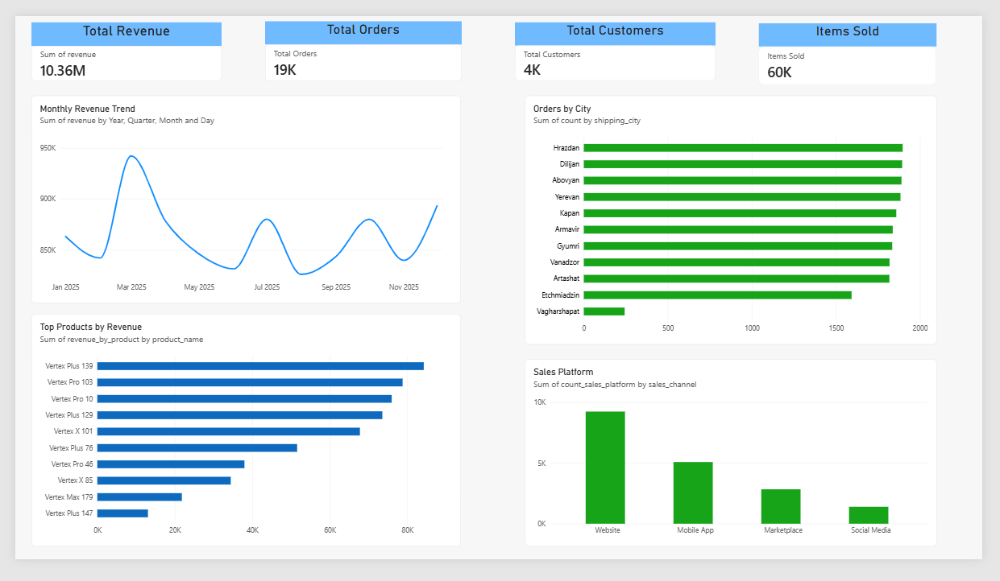
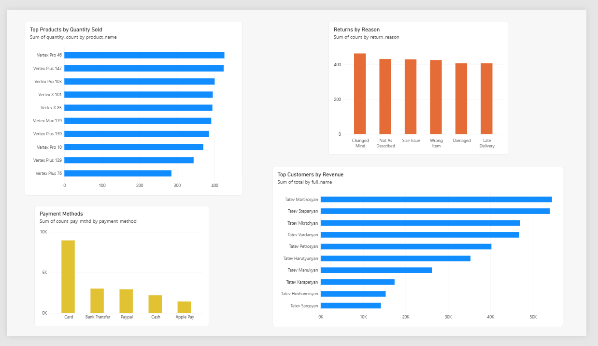

# E-Commerce Dataset Analysis

## Overview
This project is an end-to-end e-commerce data analysis pipeline built to demonstrate practical skills in Python, PostgreSQL, SQL, and Power BI.

The project starts with a messy e-commerce dataset, cleans and validates the data, loads the cleaned tables into a relational PostgreSQL database, performs analytical SQL queries and creates SQL views, and finally uses Power BI to build an interactive business dashboard.

## Project Goals
The main goals of the analysis are to:
* Clean and validate raw e-commerce data
* Build a relational PostgreSQL database
* Establish primary-key and foreign-key relationships
* Analyze sales, customers, products, orders, and returns
* Calculate revenue using quantity, unit price, and discounts
* Identify top-performing products and customers
* Analyze orders by city and sales channel
* Examine payment methods and return reasons
* Analyze monthly revenue trends
* Present the results in an interactive Power BI dashboard

## Tech Stack
* **Python** — data cleaning and preprocessing
* **Pandas** — data manipulation
* **Jupyter Notebook** — data-cleaning workflow
* **PostgreSQL** — relational database and SQL analysis
* **DBeaver** — database management and SQL development
* **Power BI** — visualization and dashboarding
* **Git/GitHub** — version control and project presentation

## Project Workflow

Raw E-Commerce Data
↓
Python / Pandas
↓
Data Cleaning & Validation
↓
Clean CSV Files
↓
PostgreSQL Database
↓
SQL Analysis & Views
↓
Power BI
↓
Interactive Dashboard


## Database Structure

The cleaned data is stored in a relational PostgreSQL database consisting of five tables:

- `customers` — customer information
- `products` — product information
- `orders` — order and shipping information
- `order_items` — products and quantities within each order
- `returns` — order return information

Primary and foreign keys are used to maintain relationships between the tables and support multi-table SQL analysis.

The complete database schema is available in [`sql/schema.sql`](sql/schema.sql).

## Data Cleaning
The raw dataset contained inconsistent and invalid records. Python was used to clean and validate the data before loading it into PostgreSQL. The cleaning workflow included:

* Handling missing and inconsistent values
* Removing duplicate records where appropriate
* Validating IDs
* Checking relationships between tables
* Removing orphaned order-item records
* Removing orphaned return records
* Creating cleaned CSV files for database loading

The validation step found and removed:
* **413** orphaned order-item records
* **34** orphaned return records

The cleaned data was then exported to CSV and loaded into PostgreSQL.

## SQL Analysis
The SQL analysis utilizes:
* Aggregations (`GROUP BY`, `ORDER BY`)
* Joins (`JOIN`)
* Common Table Expressions (`CTE`)
* Filtering (`WHERE`, `IN`)
* Date aggregation (`DATE_TRUNC`)
* Window functions

Key analyses include monthly revenue, revenue by product/customer, orders by city/sales channel, payment method distributions, and return reasons.

Analytical views and table definitions are stored in:
* [`sql/schema.sql`](sql/schema.sql)
* [`sql/analysis.sql`](sql/analysis.sql)
* [`sql/views.sql`](sql/views.sql)

## Power BI Dashboard

The Power BI dashboard contains two main pages:

1. **Executive Overview:** High-level metrics including Total Revenue, Orders, Customers, Items Sold, Monthly Trends, and top segments.
2. **Product & Customer Analysis:** Granular insights into top-selling products, top customers, payment methods, and return reasons.

### Executive Overview



### Product & Customer Analysis



*The full Power BI file is available at [`powerbi/dashboard.pbix`](powerbi/dashboard.pbix).*

## Repository Structure

```text
e_commerce_dataset_analysis/
│
├── data/
│   ├── clean/
│   └── raw/
│
├── powerbi/
│   ├── dashboard.pbix
│   ├── dashboard_overview.png
│   └── product_customer_analysis.png
│
├── sql/
│   ├── analysis.sql
│   ├── schema.sql
│   └── views.sql
│
├── data.py
├── get_clean_data.ipynb
├── E_commerce_cleaned.xlsx
├── messy_ecommerce_dataset.xlsx
├── requirements.txt
├── .gitignore
└── README.md
```

### Key Business Questions 
 
The analysis is designed to answer core business questions:

    How does revenue change over time?

    Which products generate the most revenue and highest quantities?

    Which customers generate the most revenue?

    Which cities and sales channels drive the most orders?

    Which payment methods are most commonly used?

    What are the most common reasons for returns?


### Data Model

The database follows a relational structure:
    customers
        │
        └── orders
                │
                ├── order_items ─── products
                │
                └── returns    


### Future Improvements

    Adding additional Power BI slicers and drill-through pages

    Advanced customer segmentation and RFM analysis

    Retention and repeat purchase rate analysis

    Profit margin analysis incorporating product costs

    Category-level return rate tracking  

